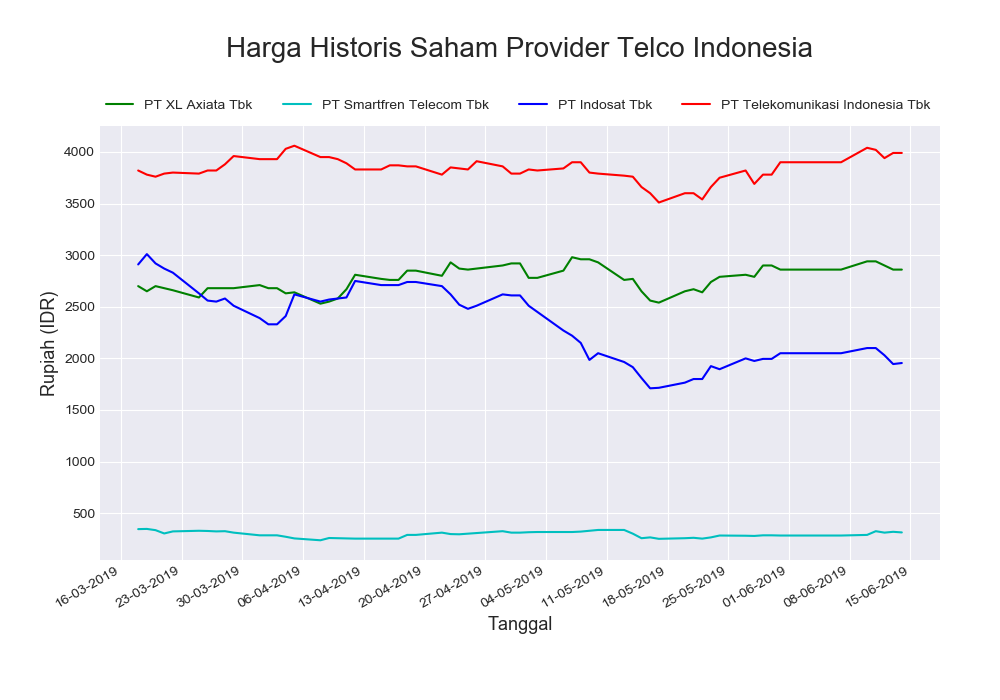

# Analytics & Visualization Exercises


#

### **Soal 1 - SPLTV (Sistem Persamaan Linear Tiga Variabel)**

Bersumber dari [blog catarinadyah90](https://catarinadyah90.wordpress.com/2014/04/28/sistem-persamaan-linear-tiga-variabel-spltv/), terdapat 3 buah persamaan linear 3 variabel sebagai berikut:

```bash
x  - 2y +  z =  6
3x +  y - 2z =  4
7x - 6y -  z = 10
```

1. Dengan menggunakan __numpy__, buatlah sebuah program __python__ yang dapat menentukan nilai x, y & z dari 3 buah persamaan di atas! Hasil yang diharapkan saat program dieksekusi adalah:

    ```bash
    Nilai x = 5.0
    Nilai y = 3.0
    Nilai z = 7.0
    ```

2. Dengan menggunakan __matplotlib__, buatlah sebuah program __python__ yang dapat menggambarkan area 3D yang merepresentasikan masing-masing persamaan di atas. Hasil yang diharapkan saat program dieksekusi berupa __1 buah figure__ dengan __3 buah plot 3D__ sebagai berikut:


_**Catatan:**_ _Lampiran jawaban dalam bentuk file SPLTV.ipynb yang sudah diupload_

#

### **Soal 2 - Dosen & Mahasiswa**

1. Tuliskan langkah-langkah/urutan query MongoDB untuk membuat sebuah database Non-RDBMS (Document Store) dengan spesifikasi sebagai berikut:

    - Terdapat sebuah database dengan nama __"Kampus"__.
    - Database __"Kampus"__ memiliki 2 buah user:
        - User pertama adalah admin database bernama __"andi"__, dengan password __"anditopsecret"__. 
        - User kedua bukanlah admin, namun tetap dapat memasukkan & membaca data dari database. User kedua bernama __"budi"__, dengan password __"buditopsecret"__.
    - Database __"Kampus"__ memiliki 2 buah collection: __"Dosen"__ dan __"Mahasiswa"__.
    - Masukkan 3 buah data berikut ke collection __"Dosen"__:

        ```javascript
        {nama:"Caca",
        usia:28,
        asal:"Jakarta",
        bidang:"Fisika Astrologi",
        titel:"S2",
        status:"Honorer",
        nip:123,
        matkul:["Metrologi","Kosmologi","Kalkulus"]}

        {nama:"Dedi",
        usia:29,
        asal:"Yogyakarta",
        bidang:"Fisika Terapan",
        titel:"S3",
        status:"PNS",
        nip:456,
        matkul:["Instrumentasi","Elektronika","Fisika Dasar"]}

        {nama:"Euis",
        usia:30,
        asal:"Bandung",
        bidang:"Fisika Teoretik",
        titel:"S1",
        status:"Honorer",
        nip:789,
        matkul:["Fisika Dasar","Fisika Modern","Kalkulus"]}
        ```

    - Masukkan 3 buah data berikut ke collection __"Mahasiswa"__:

        ```javascript
        {nama:"Faza",
        usia:19,
        asal:"Aceh",
        prodi:"Fisika",
        angkatan:2017,
        nim:123}

        {nama:"Gilang",
        usia:20,
        asal:"Semarang",
        prodi:"Fisika",
        angkatan:2017,
        nim:456}

        {nama:"Hanafi",
        usia:19,
        asal:"Makassar",
        prodi:"Fisika",
        angkatan:2017,
        nim:789}
        ```

    - Ketik jawaban dari soal nomor 3.1 ini dalam file __.txt__!

2. Dengan __pyMongo__, __matplotlib__ & __pandas__, buatlah sebuah program __python__ yang dapat mengakses dan menampilkan: 
    - __Nama, asal, usia & status__ dari daftar dosen & mahasiswa di collection tersebut. Output yang diharapkan berupa __2 buah dataframe__ sebagai berikut:
        ```bash
                 asal  nama      status  usia
        0     Jakarta  Caca       dosen    28
        1  Yogyakarta  Dedi       dosen    29
        2     Bandung  Euis       dosen    30

               asal    nama      status  usia
        0      Aceh    Faza   mahasiswa    19
        1  Semarang  Gilang   mahasiswa    20
        2  Makassar  Hanafi   mahasiswa    19
        ```
    - Sekaligus menampilkan __diagram batang__ usia dari dosen & mahasiswa. Output yang diharapkan sebagai berikut:

    

_**Catatan:**_ _Lampiran jawaban dalam bentuk file DosenMahasiswa.ipynb yang sudah diupload_

#

### **Soal 3 - Imunisasi**

Disediakan __4 buah dataset (.csv)__ seputar persentase balita di Indonesia yang pernah mendapatkan imunisasi __BCG, Campak, DPT & Polio__ dalam kurun tahun 1995-2017. Unduh dataset via kaggle: [unduh di sini](https://www.kaggle.com/lintangwisesa/balita-terimunisasi-di-indonesia-bps-19952017), lalu buatlah sebuah program __python__ yang dapat menampilkan data-data tersebut dalam bentuk sebagai berikut:

- Data yang _missing_ diolah dengan metode __interpolasi linear__, yakni jika terdapat nilai __'n.a'__ akan diubah menjadi __nilai antara data sebelum & sesudahnya__. 
    > _Tips:_ gunakan method ```interpolate()``` dari __pandas__).

- Usai program dieksekusi, akan muncul __2 buah figure__ sekaligus. Figure 1 berisi data __persentase balita yang pernah diimunisasi__, dan figure 2 berisi __persentase balita yang belum pernah diimunisasi__.

- Setiap figure berisi __4 buah diagram batang__ yang menunjukkan persentase balita yang pernah diimunisasi __BCG, Campak, DPT & Polio__ selama 1995-2017. Output yang diharapkan digambarkan sebagai berikut:

    > *Figure 1*: __Persentasi balita terimunisasi 1995-2017__
    

    > *Figure 2*: __Persentase balita tak terimunisasi 1995-2017__
    

_**Catatan:**_ _Lampiran jawaban dalam bentuk file Imunisasi.ipynb yang sudah diupload_

#

### **Soal 4 - Infografis ASEAN**

Sama seperti soal pertama, soal kedua kali ini masih menggunakan database ```world``` MySQL dan berfokus pada data negara-negara yang tergabung dalam __ASEAN (_Association of Southeast Asian Nations_)__. Aktifkan server MySQL Anda, lalu gunakan database ```world``` dan selesaikan beberapa soal berikut:

1. __Populasi ASEAN__

    Buatlah sebuah __file python__ yang dapat mengakses daftar negara ASEAN dari database ```world``` dan menampilkan populasi negara-negara ASEAN dalam bentuk diagram batang. Output yang diharapkan berupa __diagram batang__ dengan __nilai/jumlah populasi tertera__ di atas diagram. Style, desain & warna tidak harus sama, utamakan validitas data:

    

#

2. __Persentase Populasi ASEAN__

    Buatlah sebuah __file python__ yang dapat mengakses daftar negara ASEAN dari database ```world``` dan menampilkan persentase populasi negara-negara ASEAN dalam bentuk diagram lingkaran. Output yang diharapkan berupa __diagram lingkaran__ dengan __nilai persentase populasi tertera__ dalam diagram. Style, desain & warna tidak harus sama, utamakan validitas data:

    

#

3. __Gross National Product ASEAN__

    Buatlah sebuah __file python__ yang dapat mengakses daftar negara ASEAN dari database ```world``` dan menampilkan Pendapatan Bruto Nasional/GNP (Gross National Product) negara-negara ASEAN dalam bentuk diagram batang. Output yang diharapkan berupa __diagram batang__ dengan __nilai GNP tertera__ di atas diagram. Style, desain & warna tidak harus sama, utamakan validitas data:

    

#

4. __Persentase Luas Daratan ASEAN__

    Buatlah sebuah __file python__ yang dapat mengakses daftar negara ASEAN dari database ```world``` dan menampilkan persentase luas daratan negara-negara ASEAN dalam bentuk diagram lingkaran. Output yang diharapkan berupa __diagram lingkaran__ dengan __nilai persentase luas daratan tertera__ dalam diagram. Style, desain & warna tidak harus sama, utamakan validitas data:

    

_**Catatan:**_ _Lampiran jawaban dalam bentuk file Infografis ASEAN.ipynb yang sudah diupload_

#

### **Soal 5 - Harga Historis Saham Provider Telco Indonesia**

Disediakan 4 buah file __.csv__ yang berisi harga historis saham harian selama 3 bulan terakhir (18/Mar/2019 - 14/Jun/2019) dari 4 perusahaan provider telekomunikasi ternama di Indonesia. Unduh file .csv dari repo ini atau [klik sini](./dataSaham):

Nama Provider|Unduh csv
-----|-----
PT. XL Axiata Tbk|[EXCL.JK.csv](./dataSaham/EXCL.JK.csv)
PT Smartfren Telecom Tbk|[FREN.JK.csv](./dataSaham/FREN.JK.csv)
PT Indosat Tbk|[ISAT.JK.csv](./dataSaham/ISAT.JK.csv)
PT Telekomunikasi Indonesia Tbk|[TLKM.JK.csv](./dataSaham/TLKM.JK.csv)

#

1. Buatlah sebuah file __python__ yang mengakses data dari ke-4 file .csv tersebut, kemudian tampilkan data plot harga penutupan (close) harian seluruh data yang ada. Output yang diharapkan berupa __grafik garis__ yang menampilkan harga penutupan (close) harian dari ke-4 perusahaan telco selama 3 bulan terakhir:

    

#

2. Buatlah sebuah file __python__ yang mengakses data dari ke-4 file .csv tersebut, kemudian tampilkan data plot harga penutupan (close) harian selama __bulan April 2019__. Output yang diharapkan berupa __grafik garis__ yang menampilkan harga penutupan (close) harian dari ke-4 perusahaan telco selama __bulan April 2019__:

    

_**Catatan:**_ _Lampiran jawaban dalam bentuk file Historis Saham.ipynb yang sudah diupload_

#

### **Soal 6 - 🏋‍♂ SEA Games 2019**


Indonesia mengakhiri SEA Games 2019 di posisi ke-empat. Total, atlet-atlet Tanah Air sukses mengumpulkan 267 medali, dengan rincian 72 emas, 84 perak, dan 111 perunggu selama perhelatan ajang multi-event olahraga se-Asia Tenggara tersebut, sejak 30 November-11 Desember 2019. Panitia SEA Games Filipina 2019 mempublikasikan daftar peserta & perolehan medali di situs resmi: [www2.2019seagames.com](https://www2.2019seagames.com/).

- [Data peserta & perolehan medali SEA Games Malaysia 2017](https://www2.2019seagames.com/countries/)
- [Data peserta & perolehan medali SEA Games Filipina 2019](https://www2.2019seagames.com/medals/)

Gunakanlah teknik _web scraping_ pada situs di atas untuk mendapatkan data lengkap perolehan medali SEA Games 2017 & 2019. Kemudian buatlah sebuah file python (__.py__) atau notebook (__.ipynb__) yang dapat memvisualisasikan data __total raihan medali emas__ beserta __persentase raihan medali emas__ tiap Negara pada SEA Games 2017 & 2019. Contoh output yang diharapkan:

- Total raihan medali emas SEA Games 2017 & 2019. Berikan marker khusus pada Negara dengan raihan medali emas terbanyak.

    

- Persentase raihan medali emas SEA Games 2017 & 2019. Tampilkan nilai persentase pada diagram lingkaran.

    

_**Catatan:**_ _Lampiran jawaban dalam bentuk file seagames.ipynb yang sudah diupload_

#